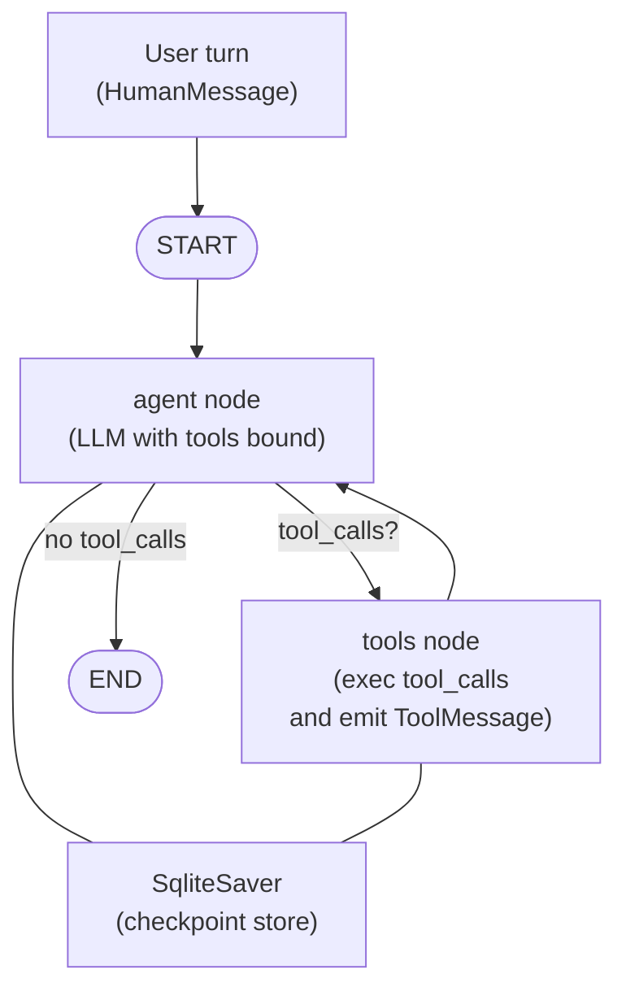

# Topic 3: Agent Tool Use

## Task 1
For topic "philosophy": `python3 llama_mmlu_eval1.py  13.58s user 4.54s system 45% cpu 40.151 total`.
For topic "sociology": `python3 llama_mmlu_eval2.py  10.70s user 3.47s system 45% cpu 31.140 total`.

Sequential execution: `3.50s user 0.61s system 1% cpu 5:31.79 total`.
Parallel execution: `7.50s user 1.37s system 2% cpu 5:14.41 total`.

The time is almost the same, and this is very likely due to a bottleneck at the ollama server.
Even in parallel execution, the ollama server still processes the request sequentially.

# Task 2

Done.

# Task 3

The calculator tool is added. See [3_output.txt](./3_output.txt) for demonstration.

# Task 4

I've added a `count_letter` tool, and a `timezone_duration` tool that compute the time duration from different time zones.
See [4_output.txt](4_output.txt), the query "Today's January 29, 2026. I'll take the plane at 5pm tonight in New York and land in Tokyo 9:30pm tomorrow, how long does the flight take?" uses all the tool and exhausts 5 iterations.

# Task 5

I reimplemented the agent using LangGraph so that the conversation is a single long-running thread instead of starting fresh on each call.

Langgraph architecture:

For example usage, see [5_output.txt](./5_output.txt).
Inside `demo_conversation`, the same `thread_id` (`"itinerary-thread"`) is reused for every turn.